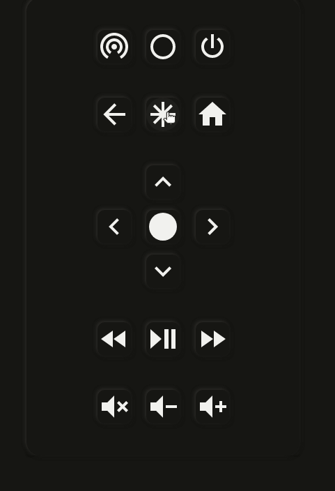

# Broadlink Custom card

Inspirted by [ROKU card](https://github.com/iantrich/roku-card)


A custom broadlink card for homeassitant. Requires the companion [custom_component](https://github.com/racelandshop/broadlink_custom_component) to work

## Card and component Setup

1. Download the [custom_component](https://github.com/racelandshop/broadlink_custom_component) and place in the `config/custom_component` folder.
2. Add this line to your `configuration.yalm` file
```yaml
broadlink_custom_card:
```

3. Download the custom broadlink card from this repository and place it in `config/www` folder
4. Register the broadlink-card:

  - 4a. Include the card code in your `ui-lovelace-card.yaml`
   ```yaml
   title: Home
   resources:
     - url: /local/broadlink-remote-card.js
       type: module
   ```
  - 4b Alternatively, go to Config -> Lovelace -> Resources in your Home Assitant instance. Click Add Resource and ad the url `/local/broadlink-remote-card.js`. Save

5. Restart Home Assistant

In case you have questions regarding the installation post in [Issues](https://github.com/racelandshop/broadllink-card/issues)

### Broadlink Remote setup

This custom card will discover and control your broadlink universal remotes. Please ensure your devices are correctly connected to your local network by following the steps bellow. If you have already configured the device with the Broadlink app, this step may not be necessary.

1. Use pip3 to install the latest version of this module.

```
pip3 install broadlink
```

2. Open a Python 3 session and import this module.

```python3
import broadlink
```

3. Put the device into AP Mode.
  - Long press the reset button until the blue LED is blinking quickly.
  - Long press again until blue LED is blinking slowly.
  - Manually connect to the WiFi SSID named BroadlinkProv.
4. Connect the device to your local network with the setup function.
```python3
broadlink.setup('myssid', 'mynetworkpass', 3)
```

Security mode options are (0 = none, 1 = WEP, 2 = WPA1, 3 = WPA2, 4 = WPA1/2)


For more information you can check the amazing [python-broadlink](https://github.com/mjg59/python-broadlink) repository.

## FEATURES

### Card Overview


### Discover New Devices

The broadlink devices and discovered when the homeassistant is started and when the user clicks on the "Discover" button in the card editor:


### Learning Mode

To enter the learning mode, press the top right button on the remote. When you enter this mode, the remote lights up. Pressing any other button in this mode will make the broadlink device light up. If you send a IF code (by pointing a real life remote to the device) it will bind the code into the broadlink remote.

This card has 2 learning modes: a "quick" and a "long":

- If you use a short press on the learning Mode button after the command is learned it goes out of the learning mode
- If you use a long tap, the remote will stay on learning mode until you turn it off



### Presets

The learned commands are preset specific. You can create as many presets as you want for the same remote (broadlink entity). Each preset get registered as a new entity. You can use these entities for automations.


## For Developers

### Setting up the enviroment

After cloning this git repository, open the dev container.
Run ```yarn start``` inside the container.
Add the card url in the resources tab (http://localhost:5006/broadlink-remote-card.js)


### Test (In Developement, subject to change)

#### Run tests

For testing purposes I'm using python-playwright

1 - Create a new dashboard named Test. This is the dashboard that will be acessed. Make sure you have taken control of this dashboard (by clicking in the edit button) and that this dashboard is empty. Furthermore, make sure the broadlink card is avaiable for the frontend

2 - Run the command ```pytest tests --slowmo 1000```. This will execute all the test in slow motion as well as possible assertions


#### Introduce new tests.
For writing test code, we use the codegen feature from playwright

Run the following command:

```
playwright codegen  --viewport-size=1200,900 --target python-async localhost:8123/lovelace-test/0
```

When writing test try to use only the "test" dashboard and make sure the test remove all the changes to dashboard. This ensure other test can run